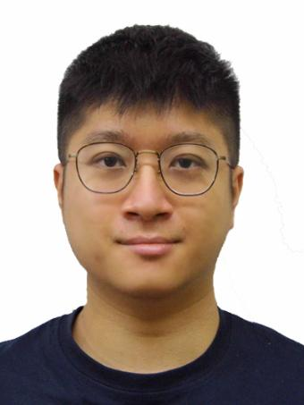
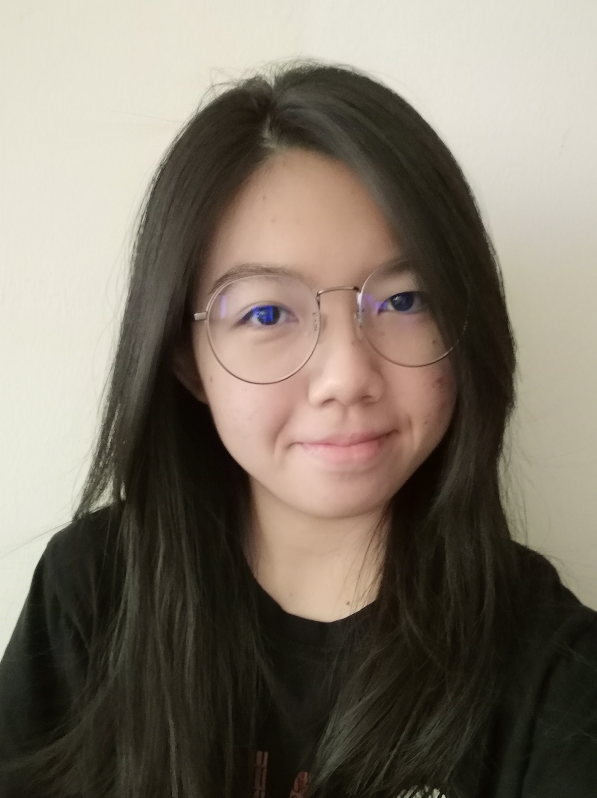
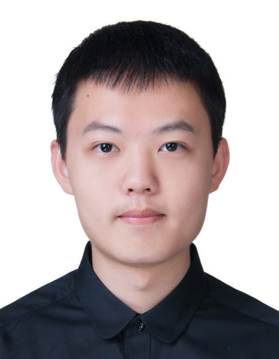

We are a team based in the [School of Computing, National University of Singapore](http://www.comp.nus.edu.sg).

You can reach us at the email `wilfredw@comp.nus.edu.sg`

## Project team

### Wilfred Wong Kang Chee

[[github](https://github.com/wilfredwongkc)]
[[portfolio](team/wilfredwongkc.md)]

* Role: Developer
* Responsibilities: In charge of UI component

### Lim Yu Long

[[github](http://github.com/yulonglim)]
[[portfolio](team/yulonglim.md)]

* Role: Developer
* Responsibilities: In charge of Storage component

### Chung Yunseong

[[github](http://github.com/jasonc01)]
[[portfolio](team/jasonc01.md)]

* Role: Developer
* Responsibilities: In charge of Model component

### Liew Xin Yi

[[github](http://github.com/xyliew25)]
[[portfolio](team/xyliew25.md)]

* Role: Developer
* Responsibilities: In charge of Logic component

### YU SHUFAN

[[github](http://github.com/fans2619)]
[[portfolio](team/fans2619.md)]

* Role: Developer
* Responsibilities: In charge of software architecture, code quality, and testing
