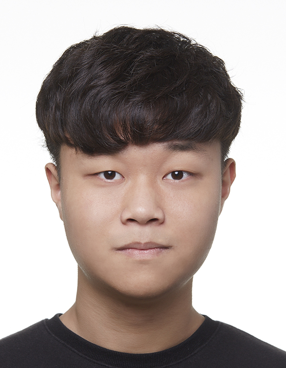

We are a team based in the [School of Computing, National University of Singapore](http://www.comp.nus.edu.sg).

You can reach us at the email `wilfredw[at]comp.nus.edu.sg`

## Project team

### John Doe

[[homepage](http://www.comp.nus.edu.sg/~damithch)]
[[github](https://github.com/johndoe)]
[[portfolio](team/johndoe.md)]

* Role: Project Advisor

### Wilfred Wong

[[github](https://github.com/wilfredwongkc)]
[[portfolio](team/wilfredwongkc.md)]

* Role: Developer
* Responsibilities: Data

### Lim Yu Long

[[github](http://github.com/yulonglim)]
[[portfolio](team/yulonglim.md)]

* Role: Developer
* Responsibilities: UI

### Chung Yunseong

[[github](http://github.com/JasonC01)] [[portfolio](team/JasonC01.md)]

* Role: Developer
* Responsibilities: Data

### Liew Xin Yi

[[github](http://github.com/xyliew25)]
[[portfolio](team/xyliew25.md)]

* Role: Developer
* Responsibilities: Data

### Yu Shufan

[[github](http://github.com/fans2619)]
[[portfolio](team/fans2619.md)]

* Role: Developer
* Responsibilities: UI
