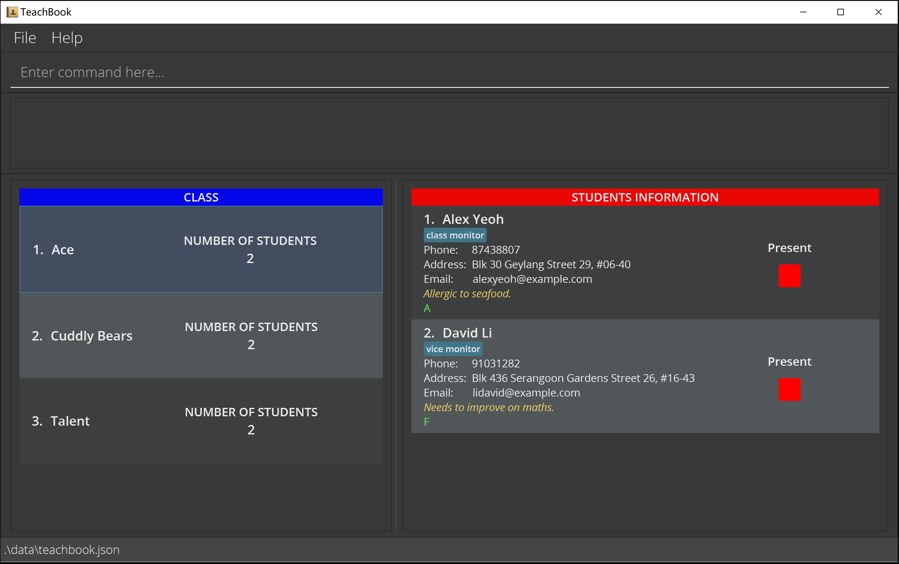
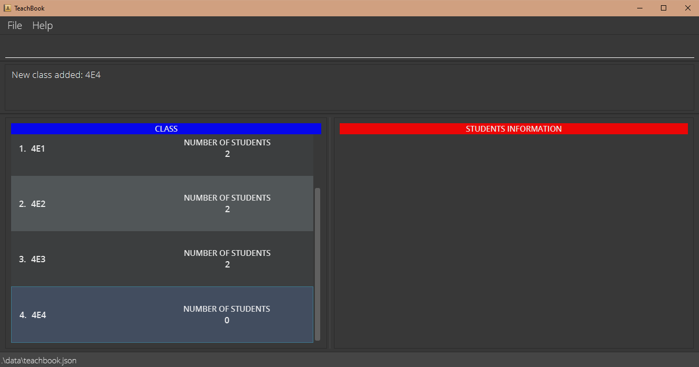

* Table of Contents
{:toc}

## Introduction

Welcome to the TeachBook User Guide! 

If you are a primary or secondary school teacher who is using TeachBook, or just someone who wants to find out more 
about what TeachBook can do, you are at the right place!

In this user guide, you will find step-by-step instructions on how you can install TeachBook and guide on how to use all 
of its features.

[comment]: <> (its features. Did we also mention that TeachBook is free?)

## How to use this guide?

As this user guide is created for users with varying levels of experience using our app, it is divided in different 
sections, so feel free to navigate to the portion of interest using our handy Table of Contents provided below. If you 
are a new user who is using TeachBook for the first time, you can follow the [Quick Start](#quick-start) on how to get 
TeachBook running on your system for the first time. If you are a user who faced some issues with TeachBook, you can go 
to the [FAQs](#faqs) section to see if your issues have already been addressed. If not, feel free to reach out to us, 
and we will respond promptly. If you are an experienced user who can't remember the extensive list of features that 
TeachBook provide, you can jump to the [Command Summary](#command-summary) section or the [Features](#features) section 
if you want to find out more.

There are 3 symbols that you need know in order to use this user guide effectively, and they are :information_source:, 
:bulb: and :exclamation:

* If you see a :information_source: symbol, it means that it is additional information that we feel that you ought to know.

* If you see a :bulb: symbol, it means that it is a tip (e.g. shortcut or hidden features) which you can follow to enhance
your experience. 

* If you see a :exclamation: symbol, take extra caution because if you don't follow the instruction listed, it might cause 
the program to not run the way you intended it to and return unwanted results.

## What is TeachBook?

TeachBook is a **desktop app for primary and secondary school teachers to manage student contacts, optimized for use via
a Command Line Interface** (CLI) while still having the benefits of a Graphical User Interface (GUI). It is targeted 
towards teachers who can type fast. It allows teachers to store and organise contacts related to their students into 
different classes. On top of that, teachers can tag the class role of the student.

--------------------------------------------------------------------------------------------------------------------

## Quick start

1. Ensure you have Java `11` or above installed in your computer.

2. Download the latest `teachbook-v1.3.1.jar` from [here](https://github.com/AY2122S1-CS2103T-W10-2/tp/releases/download/v1.3.1/teachbook-v1.3.1.jar).

3. Copy the file to the folder you want to use as the _home folder_ for your TeachBook.

4. Double-click the file to start the app. The GUI similar to the below should appear in a few seconds. Note how the app contains some sample data. 
   

5. Type the command in the command box and press Enter to execute it. e.g. typing **`help`** and pressing Enter will open the help window. 
   Some example commands you can try:

    * **`select Talent`** : Displays all the students from the class named `Talent`.
   
    * **`delete`**`2` : Deletes the 2nd student shown in the list on the right.

    * **`addClass`**`Class D` : Adds a new class named `Class D` to the TeachBook.
    
    * **`clear`** : Clears all existing data in the TeachBook.

    * **`exit`** : Exits the app.

6. Refer to the [Features](#features) below for details of each command.

--------------------------------------------------------------------------------------------------------------------
## Graphical User Interface

{add an image of the GUI with boxes to explain the different portions of the app}

--------------------------------------------------------------------------------------------------------------------

## Features

**:information_source: Notes about the command format:** 

* Words in `UPPER_CASE` are the parameters to be supplied by the user. 
  e.g. in `add n/NAME`, `NAME` is a parameter which can be used as `add n/Xin Yi`.

* The parameter `INDEX` refers to the index number currently shown in the displayed student list, and it must be a positive integer 1, 2, 3, …

* Items in square brackets are optional. 
  e.g. `n/NAME [t/TAG]` can be used as `n/Joseph Chan t/class monitor` or as `n/Joseph Chan`.

* Items **in** square brackets with `…` after them can be used multiple times including zero times. 
  e.g. `[t/TAG]…` can be used as ` `&nbsp;(i.e. 0 times), `t/friend`, `t/friend t/family` etc.

* Items **outside** square brackets with `…` after them can be used multiple times but at least once. 
  e.g. `INDEX…` can be used as `1`, `2 3`, `1 4 5 9` etc.

* Items separated by `||` means only one of the partitioned items should be supplied. 
  e.g. `sort name||grade` can be used as either `sort name` or `sort grade`, but not `sort name grade`.

* If a command accepts more than one parameter (i.e. word in `UPPER_CASE`), parameters can be in any order. However, this does not apply to parameter `INDEX`, which should always be specified before others. 
  e.g. if the command specifies `n/NAME p/PHONE_NUMBER`, `p/PHONE_NUMBER n/NAME` is also acceptable.

* If a parameter is expected only once in the command, but you specified it multiple times, only the **last** occurrence of the parameter will be taken. 
  e.g. if you specify `p/12341234 p/56785678`, only `p/56785678` will be taken.

* Extraneous parameters for commands that do not take in parameters (such as `help`, `exit` and `clear`) will be ignored. 
  e.g. if the command specifies `help 123`, it will be interpreted as `help`.

### Viewing help : `help`

Shows a message explaining how to access the help page.

Format: `help`

### Adding a class : `addClass`

Adds a class with the specified class name to the TeachBook.

Format: `addClass CLASS_NAME`

Examples:
* `addClass 4E2` adds a class named `4E2` into the TeachBook.

:exclamation: **Caution:**
There is a limit of 20 characters for the class name! But I am sure your class name will not be longer that limit!

### Editing a class name : `editClass`

Edits the name of the currently selected class.

Format: `editClass CLASS_NAME`

Examples:
* `editClass ClassA` edits the name of the currently selected class to be `ClassA`.

### Selecting a class : `select`

Selects a class to be shown by the TeachBook.

Format: `select CLASS_NAME`

* The `CLASS_NAME` to be selected is case-sensitive and must be already inside the list. If not the TeachBook will return `The class does not exist`.
* The currently selected class will be highlighted in blue as seen in the image below where the class named `B` is selected.

[comment]: <> (![select_example]&#40;images/select_example.png&#41;)

Example:
* `select B` selects the class named `B` from the list of classes.

### Deleting a class : `deleteClass`

Deletes the specified class from the TeachBook.

Format: `deleteClass CLASS_NAME`

* Deletes the class with the specified `CLASS_NAME`

Examples:
* `deleteClass A` Deletes the class named `A` from the TeachBook.

### Adding a student : `add`

You can use this command to add a student into the currently selected class.

Format: `add n/NAME [p/PHONE_NUMBER] [e/EMAIL] [a/ADDRESS] [t/TAG]…`

[comment]: <> (![add]&#40;images/addStudent.png&#41;)

:bulb: **Tip:**
A student can have any number of tags (including 0)

* A class must be selected before adding a student.
* Everything is optional except for name of the student.
* You can add multiple tags by adding more `t/` flags.

Examples:
* `add n/John Doe` adds a student named John Doe into the currently selected class.
* `add n/Jane Doe p/91234567 e/johndoe@example.com a/21 Lower Kent Ridge Road, Singapore 119077 t/Class Monitor` adds contact information of Jane Doe with all the optional information into the currently selected class.

### Editing a student : `edit`

Edits the basic information of an existing student in the TeachBook.

Format: `edit INDEX [n/NAME] [p/PHONE_NUMBER] [e/EMAIL] [a/ADDRESS] [t/TAG]…`

:bulb: **Tip:**
You can clear a field by omitting the value after the prefix.

* Edits the student at the specified `INDEX`.
* Existing values will be updated to the input values.

Examples:
* `edit 1 p/91234567 e/johndoe@example.com` edits the phone number and email address of the 1st student shown in the list to be `91234567` and `johndoe@example.com` respectively.
* `edit 2 n/Joseph Chan t/` edits the name of the 2nd student shown in the list to be `Joseph Chan` and clears all existing tags.

### Locating students by name : `find`

Finds students whose name contain any of the given keywords.

Format: `find KEYWORD…`

* The search is case-insensitive e.g. john, JOHN or JoHn will match John.
* The order of the keywords does not matter e.g. Doe John will match John Doe.
* Only the name is searched.
* Only full words will be matched e.g. John will not match Johnny.
* Students matching at least one keyword will be returned (i.e. OR search). e.g. John Doe will return Jone Deer, Jane Doe.

Examples:
* `find John Doe` returns only one `John Doe` from the currently selected class, even though there is another `John Doe` from a different class.
* `list all` followed by `find John Doe` returns two `John Doe`, assuming that there are two `John Doe` in the entire the TeachBook, one from class `A` and another one from class `B`.

[comment]: <> (![find]&#40;images/findStudent.png&#41;)

### Deleting a student : `delete`

Deletes the specified student from the TeachBook.

Format: `delete INDEX…||all`

* Deletes the student at the specified `INDEX`.

Examples:
* `list all` followed by `delete 2 3` deletes the 2nd and 3rd students in the TeachBook.
* `find John` followed by `delete 1` deletes the 1st student in the results of the `find` command.
* `select A` followed by `delete all` deletes all the students in class `A`.

### Adding a remark to a student : `remark`

TeachBook allows you to add special remarks for students.

Format: `remark INDEX r/[REMARK]`

Example:
* `remark 1 r/Contracted COVID-19` add a remark to the student at index 1 that he has contracted COVID-19.

### Setting a grading system : `setGrade`

TeachBook allows for setting of personalised grading system. You may implement your own grading system
which may differ from semester to semester and subject to subject in order to grade your students accordingly.
Grades are set in descending order, from the highest to the lowest grade.

Format: `setGrade GRADE_1[>GRADE_2]…`

Example:
* `setGrade A>B>C>D` sets the grading system where A is the highest grade and D is the lowest grade.

:exclamation: **Caution:**
This command takes in a list of grades separated by ">" and they are entered in decreasing order!

### Giving grade to a student : `grade`

You can use this command to set a grade for a particular student.

Format: `grade INDEX…||all g/[GRADE]`

Example:
* `grade 1 g/B` gives the student at index 1 a B grade.
* `grade 2 4 5 g/A` gives the 2nd, 4th, and 5th students A grades.
* `grade all g/A` gives all students A grades.

:exclamation: **Caution:**
You cannot grade a student without having first add grading system. So, remember to do that first!

### Resetting the grading system : `resetGrade`

Teachbook can only incorporate at most 1 grading system at any time. Therefore, you have to wipe out an existing
grading system before implementing a new one. This command not only resets the grading system, but also wipes out
all the grades which were previously given to the students.

Format: `resetGrade`

### Sorting students : `sort`

Unorganised lists are a pain to see. Therefore, TeachBook provides the functionality for you to sort your students either according to their name or grade.

Format: `sort name||grade`

Examples:
* `sort name` sorts the list of students according to their name in alphabetical order.
* `sort grade` sorts the list of students according to their grade in descending order.

### Marking the attendance of a student : `mark`

You can use this to mark your student as present.

Format: `mark INDEX…||all`

Examples:
* `mark 1` marks the student at index 1 as present.
* `mark 2 3 4` marks the students at index 2, 3 and 4 as present.
* `mark all` marks all the students present.

:information_source: **Info**
This command allows you to mark multiple indexes at once. Which can save you lots of time! The check box will turn green
once the attendance of the student is marked! 

### Unmarking the attendance of a student : `unmark`

You can use this to mark your student as absent.

Format: `unmark INDEX…||all`

Examples:
* `unmark 1` marks the student at index 1 as absent.
* `unmark 2 3 4` marks the students at index 2, 3 and 4 as absent.
* `unmark all` marks all the students absent.

:information_source: **Info**
This command allows you to unmark multiple indexes at once. Which can save you lots of time! The check box will turn red
once the attendance of the student is unmarked!

### Listing all students : `list`

Shows the list of all students from the currently selected class or the entire TeachBook.

Format: `list [all||absent]`

* `list` lists all students from the currently selected class or the entire TeachBook.
* `list all` lists all students in the TeachBook.
* `list absentee` lists all students from the currently selected class or the entire TeachBook whose status is unmarked.

[comment]: <> (![list all]&#40;images/listAll.png&#41;)

:bulb: **Tip:**
`list all` clears any currently selected class. As a result, any command followed by `list all` will be operating on all students in the TeachBook.

### Printing to Excel : `print`

Generates an Excel file containing students in the currently shown list.

Format: `print [c/class] [c/phone] [c/email] [c/tags] [c/remark] [c/grade] [c/attendance] [c/COLUMN_TITLE]…`

* First column is always the names of students in the currently shown list.
* You can add one or more empty columns with customized titles.

Examples:
* `print c/class c/email c/Signature` creates an Excel (.xls) file with four columns, student name column, class column, email column, and an empty column with title `Signature`.

### Clearing all entries : `clear`

Deletes all classes and students, and resets the grading system of the TeachBook.

Format: `clear`

:bulb: **Tip:**
Don't forget that TeachBook provides an undo feature just in case you accidentally clear TeachBook of all its data!

### Undoing a command : `undo`

Allows you to undo a command that you have entered. You most likely will be using this command if you have made a mistake.

Format: `undo`

### Redoing a command: `redo`

Allows you to redo a command after using an undo command.

Format: `redo`

### Exiting the program : `exit`

Exits TeachBook.

Format: `exit`

:information_source: **Info**
TeachBook will automatically save you progress if you exit the app so that you can continue working on it at a later time!

### Saving the data

TeachBook data are saved in the hard disk automatically after any command that changes the data. There is no need to save manually.

### Editing the data file

TeachBook data are saved as a JSON file `[JAR file location]/data/teachbook.json`. Advanced users are welcome to update data directly by editing that data file.

:exclamation: **Caution:**
If your changes to the data file makes its format invalid, TeachBook will discard all data and start with an empty data file at the next run.

--------------------------------------------------------------------------------------------------------------------

## FAQs

**Q**: How do I transfer my data to another Computer?  
**A**: Install the app in the other computer and overwrite the empty data file it creates with the file that contains the data of your previous AddressBook home folder.  
 
**Q**: Where does the Excel file save to after using the print command?  
**A**: It will be saved to your computer's download folder.  

[comment]: <> (file path is given in command result)

--------------------------------------------------------------------------------------------------------------------

## Command Summary

Action                         | Format, Examples
-------------------------------|------------------
**Help**                       | `help`
**Add class**                  | `addClass CLASS_NAME`   e.g., `addClass A`
**Edit class**                 | `editClass CLASS_NAME`   e.g., `editClass 1 n/Ace`
**Select class**               | `select CLASS_NAME`   e.g., `select A`
**Delete class**               | `deleteClass CLASS_NAME`   e.g., `deleteClass A`
**Add student**                | `add n/NAME [p/PHONE_NUMBER] [e/EMAIL] [a/ADDRESS] [t/TAG]…`   e.g., `add n/John Doe p/91234567 e/johndoe@example.com a/21 Lower Kent Ridge Road, Singapore 119077 b/AB+ pc/92039923 t/class treasurer`
**Edit student**               | `edit INDEX [n/NAME] [p/PHONE_NUMBER] [e/EMAIL] [a/ADDRESS] [t/TAG]…`   e.g.,`edit 2 n/Joseph Chan t/`
**Find student**               | `find KEYWORD…`   e.g., `find James Jake`
**Delete student**             | <code>delete INDEX…&#124;&#124;all</code>   e.g., `delete 1`
**Add remark to student**      | `remark INDEX r/[REMARK]`   e.g., `remark 1 r/Contracted COVID-19`
**Set grading system**         | `setGrade GRADE_1[>GRADE_2]…`   e.g., `setGrade A>B>C>D>E>F`
**Give grade to student**      | <code>grade INDEX…&#124;&#124;all g/&#91;GRADE&#93;</code>   e.g., `grade 3 g/A`
**Reset grading system**       | `resetGrade`
**Sort students**              | <code>sort name&#124;&#124;grade</code>
**Mark student attendance**    | <code>mark INDEX…&#124;&#124;all</code>   e.g., `mark 1 2 3`
**Unmark student attendance**  | <code>unmark INDEX…&#124;&#124;all</code>   e.g., `unmark 1 2 3`
**List students**              | <code>list &#91;all&#124;&#124;absent&#93;</code>
**Print data as Excel file**   | `print [c/class] [c/phone] [c/email] [c/tags] [c/remark] [c/grade] [c/attendance] [c/COLUMN_TITLE]…`   e.g. , `print c/Signature`
**Clear all data**             | `clear`
**Undo previous command**      | `undo`
**Redo previous command**      | `redo`
**Exit**                       | `exit`
