## Table of Contents

* Table of Contents
{:toc}

## Introduction

Welcome to this TeachBook User Guide!

If you are a primary or secondary school teacher who is using TeachBook, or just someone who wants to find out more
about what TeachBook can do, you are at the right place.

In this user guide, you will find step-by-step instructions on how you can install TeachBook and a guide on how to use all
of its features.

## What is TeachBook?

TeachBook is a **desktop app for primary and secondary school teachers to manage student contacts, optimized for use via
a Command Line Interface** (CLI) while still having the benefits of a Graphical User Interface (GUI). It is targeted
towards teachers who can type fast. It allows teachers to store and organise contacts related to their students into
different classes.

[comment]: <> (for 2101, rephrase the last sentence above?)

## How to use this guide?

As this user guide is created for users with varying levels of experience using the app, it is divided in different
sections, so feel free to navigate to the portion of interest using our handy [Table of Contents](#table-of-contents) provided above.

* If you are a **new user who is using TeachBook for the first time**, you can follow the [Quick Start](#quick-start) on how to get
  TeachBook running on your system for the first time.

* If you are an **intermediate user who is facing some issues with TeachBook**, you can go to the [FAQs](#faqs) section to see if your issues
  have already been addressed. If not, feel free to reach out to us, and we will respond promptly.

* If you are an **experienced user who can't remember the extensive list of features that TeachBook provides**, you can jump to the [Command Summary](#command-summary) section or the [Features](#features) section
  if you want to find out more.

There are 3 symbols that you need to know in order to use this user guide effectively, and they are :information_source:,
:bulb: and :exclamation:. Refer to the table below for more information.

Symbol                 | Meaning
-----------------------|---------
:information_source:   | additional information that we feel that you ought to know
:bulb:                 | a tip (e.g. shortcut or hidden features) which you can follow to enhance your experience using TeachBook
:exclamation:          | an extra caution you have to take to prevent any unwanted results

--------------------------------------------------------------------------------------------------------------------
[\[ Back to top \]](#table-of-contents)
## Quick Start

1. Ensure you have Java `11` or above installed on your computer.

2. Download the latest `TeachBook-v1.4.0.jar` from [here](https://github.com/AY2122S1-CS2103T-W10-2/tp/releases/download/v1.4/TeachBook-v1.4.0.jar).

3. Copy the file to the folder you want to use as the _home folder_ for your TeachBook.

4. Double-click the file to start the app. The GUI similar to the below should appear in a few seconds. Note how the app contains some sample data. 

   

5. Type the command in the command box and press `Enter` to execute it. For example, typing **`help`** and pressing `Enter` will open the help window.  

   Some example commands you can try:

    * **`select`**`4E2` : Displays all the students from the class named `4E2`.

    * **`delete`**`2` : Deletes the 2nd student shown in the list on the right.

    * **`addClass`**`4E4` : Adds a new class named `4E4` to the TeachBook.

    * **`clear`** : Clears all existing data.

    * **`exit`** : Exits the app.

6. Refer to the [Features](#features) below for details of each command.

--------------------------------------------------------------------------------------------------------------------
[\[ Back to top \]](#table-of-contents)
## Graphical User Interface

In this section, we will be guiding you through the different sections of TeachBook's Graphical User Interface (GUI).
There are a total of 5 different sections according to the image of our GUI below (highlighted in red) and they are the:
* **Menu Bar**
* **Command Box** (Place for you to type in the command)
* **Result Display** (Place where the result of the command will be displayed)
* **Class List** (Place where you can see the list of classes that you have added)
* **Student List** (Place where you can see the list of students that you have added)

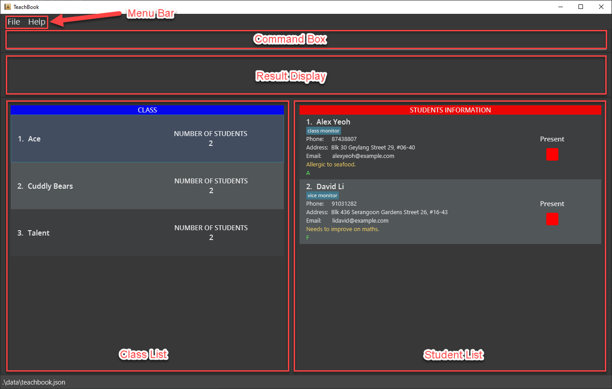

--------------------------------------------------------------------------------------------------------------------
[\[ Back to top \]](#table-of-contents)

## Features

**:information_source: Notes about the command format:** 

* Words in `UPPER_CASE` are the parameters to be supplied by the user. 
  e.g. in `add n/NAME`, `NAME` is a parameter that can be used as `add n/Jane Doe`.

* The parameter `INDEX` refers to the index number currently shown in the student list, and it must be a positive integer 1, 2, 3, …

* Items in square brackets are optional. 
  e.g. `n/NAME [t/TAG]` can be used as `n/Joseph Chan t/class monitor` or as `n/Joseph Chan`.

* Items **in** square brackets with `…` after them can be used multiple times including zero times. 
  e.g. `[t/TAG]…` can be used as <code>&nbsp;</code> (i.e. 0 times), `t/friend`, `t/friend t/family` etc.

* Items **outside** square brackets with `…` after them can be used multiple times but at least once. 
  e.g. `INDEX…` can be used as `1`, `2 3`, `1 4 5 9` etc.

* Items separated by `||` means only one of the partitioned items should be supplied. 
  e.g. `sort name||grade` can be used as either `sort name` or `sort grade`, but not `sort name grade`.

* If a command accepts more than one parameter (i.e. word in `UPPER_CASE`), parameters can be in any order. However, this does not apply to the parameter `INDEX`, which should always be specified before others. 
  e.g. if the command specifies `n/NAME p/PHONE_NUMBER`, `p/PHONE_NUMBER n/NAME` is also acceptable.

* If a parameter is expected only once in the command, but you specified it multiple times, only the **last** occurrence of the parameter will be taken. 
  e.g. if you specify `p/12341234 p/56785678`, only `p/56785678` will be taken.

* Extraneous parameters for commands that do not take in parameters (such as `help`, `exit`, and `clear`) will be ignored. 
  e.g. if the command specifies `help 123`, it will be interpreted as `help`.

### Basic features
#### Viewing help : `help`

This command provides you with a link back to this user guide whenever you are in need of assistance.

Format: `help`

Fig 1: Help window popup when `help` command is executed
 

#### Clearing all entries : `clear`

This command deletes all classes and students, and resets the grading system of the TeachBook, giving you a fresh TeachBook to work with.

Format: `clear`

:bulb: **Tip:**
Don't forget that TeachBook provides an undo feature just in case you accidentally clear all the data!

 

#### Undoing a command : `undo`

This command allows you to revert the TeachBook to the previous state. You most likely will be using this command if you have made a mistake.

Format: `undo`

:information_source: **Info:**
* If a command executed results in an error message, nothing in the TeachBook will change, hence you do not have to undo it.
* Commands that do not cause any changes in data or display cannot be undone (e.g. `print`, `help`, etc.).

 

#### Redoing a command: `redo`

This command allows you to redo a command after using an `undo` command, just in case you undid it accidentally.

Format: `redo`

 

#### Exiting the program : `exit`

This command will exit TeachBook. There is no need to save any data manually.

Format: `exit`

--------------------------------------------------------------------------------------------------------------------
[\[ Back to top \]](#table-of-contents)

### Class related features
#### Adding a class : `addClass`

This command allows you to add a new class into TeachBook. After this, you can start organising the class by adding students inside.

Format: `addClass CLASS_NAME`

* Adds the class with the specified `CLASS_NAME`.
* The `CLASS_NAME` is case and space sensitive and should not be already inside the TeachBook.

Examples:
* `addClass 4E4` adds a class named `4E4` into the TeachBook.

Fig 2: Class `4E4` is added after `addClass 4E4` is executed

#### Deleting a class : `deleteClass`

This command allows you to delete a class currently in TeachBook. All the students in the class will also be deleted.
With this command, you can easily delete a whole class without the need to delete individual students.

Format: `deleteClass CLASS_NAME`

* Deletes the class with the specified `CLASS_NAME`.
* The `CLASS_NAME` is case and space sensitive and should be inside the TeachBook.

Examples:
* `deleteClass 4E4` deletes the class named `4E4` from the TeachBook.

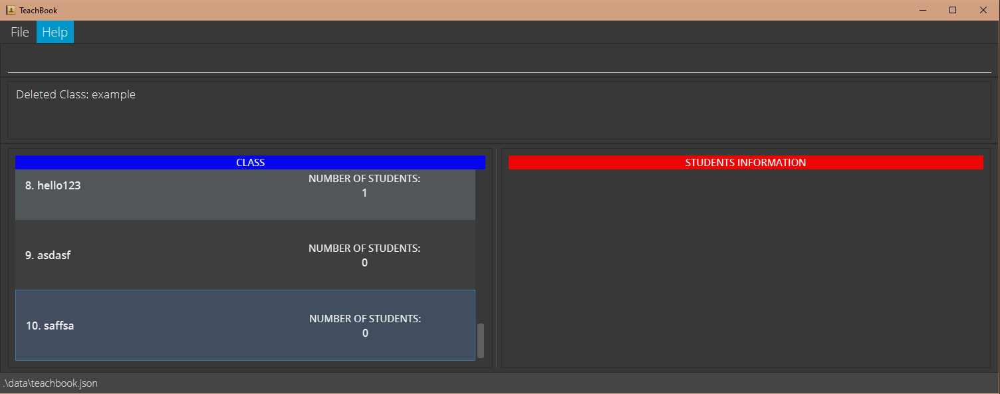
Fig 3: Class `4E4` added in [addClass](#adding-a-class--addclass) is deleted after `deleteClass 4E4` is executed

#### Editing a class name : `editClass`

Just in case you made a spelling mistake in your class name or willing to change the name of the class, you can use
this command to edit the name of the currently selected class.

Format: `editClass CLASS_NAME`

* Edits the name of the **currently selected class** to the specified `CLASS_NAME`
* The `CLASS_NAME` is case and space sensitive and should not be already inside the TeachBook.

Examples:
* `editClass 4E5` edits the name of the currently selected class to be `4E5`.

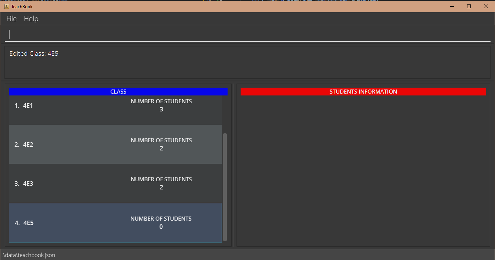
Fig 4: Class `4E4` added in [addClass](#adding-a-class--addclass) is now named `4E5` after `editClass 4E5` is executed

#### Selecting a class : `select`

This command allows you to navigate to a class so that you can view students in that class.

Format: `select CLASS_NAME`

* Navigates to the class with the specified `CLASS_NAME`.
* The `CLASS_NAME` is case and space sensitive and should be inside the TeachBook.

:information_source: **Info:**
The currently selected class is highlighted in blue in the class list.

:information_source: **Info:**
We are currently working on a new feature that allows you to select a class by its index so that you will not need to type out the entire class name!

Example:
* `select 4E2` selects the class named `4E2` in the TeachBook.

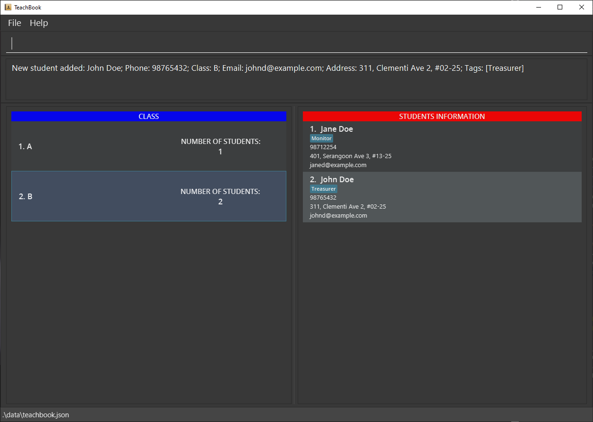
Fig 5: Class `4E2` is highlighted in blue with its students list displayed after `select 4E2` is executed

--------------------------------------------------------------------------------------------------------------------
[\[ Back to top \]](#table-of-contents)

### Student related features
#### Adding a student : `add`

Start organising your classes by adding students. This command allows you to add a new student to the currently selected class.

Format: `add n/NAME [p/PHONE_NUMBER] [e/EMAIL] [a/ADDRESS] [t/TAG]…`

* A class should be selected before adding a student.
* Everything is optional except for the name of the student.
* The `NAME` is case and space sensitive and should not be already inside the class.
* You can add multiple tags by adding more `t/` flags.

:bulb: **Tip:**
A student can have any number of tags (including 0)

:bulb: **Tip:**
If you have multiple students with the same name in a class (although unlikely), you can use different capitalization or different spacing in the names.

Examples:
* `add n/John Doe` adds a student named John Doe into the currently selected class.
* `add n/Jane Doe p/91234567 e/janedoe@example.com a/21 Lower Kent Ridge Road, Singapore 119077 t/class monitor` adds contact information of Jane Doe with all the optional information into the currently selected class.

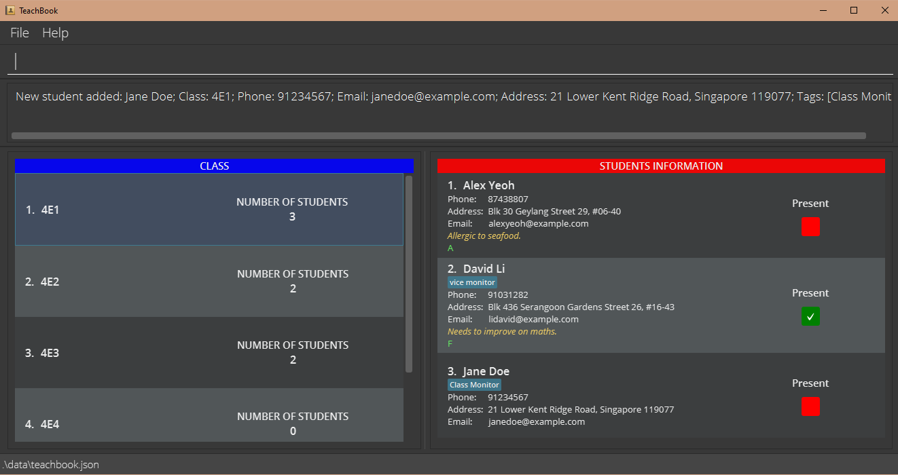
Fig 6: Student `Jane Doe` is added into Class `4E1` after the second example command above is executed

 

#### Deleting a student : `delete`

Just in case you have added a student to the wrong class, this command allows you to remove the student from the TeachBook.

Format: `delete INDEX…||all`

* `delete INDEX…` deletes the students at the specified `INDEX`s.
* `delete all` deletes all the students currently displayed in the student list.

:information_source: **Info:**
We are currently working on a new feature that allows you to move a student to another class so that you will not need to delete and add the student!

Examples:
* `list all` followed by `delete 2 3` deletes the 2nd and 3rd students in the TeachBook.
* `find John` followed by `delete 1` deletes the 1st student in the results of the `find` command.
* `select 4E2` followed by `delete all` deletes all the students in class `4E2`.

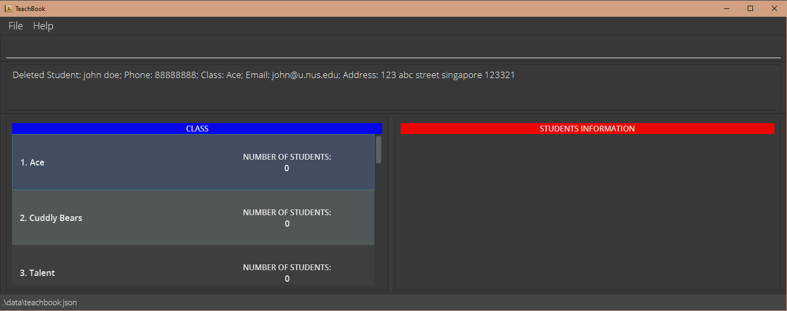
Fig 7: Student `Jane Doe` added in [add](#adding-a-student--add) is removed from Class `4E1` after `delete 3` is executed

 

#### Editing a student : `edit`

This command allows you to edit students' information at any time if there are any changes.

Format: `edit INDEX [n/NAME] [p/PHONE_NUMBER] [e/EMAIL] [a/ADDRESS] [t/TAG]…`

* Edits the information of the student at the specified `INDEX`.
* At least one field to edit must be specified.
* Existing values will be **overwritten** by input values.

:bulb: **Tip:**
You can clear a field by omitting the value after the prefix.

:exclamation: **Caution:**
Tags cannot be replaced individually. For example, if the current tags of the student at index `1` are `class monitor` and `excellent grade`, calling `edit 1 t/allergic to seafood`
will clear the original tags `class monitor` and `excellent grade`, resulting in the student having only one tag `allergic to seafood`.

Examples:
* `edit 1 p/91234567 e/johndoe@example.com` edits the phone number and email address of the 1st student shown in the list to be `91234567` and `johndoe@example.com` respectively.
* `edit 3 n/Joseph Chan t/` edits the name of the 3rd student shown in the list to be `Joseph Chan` and clears all existing tags.

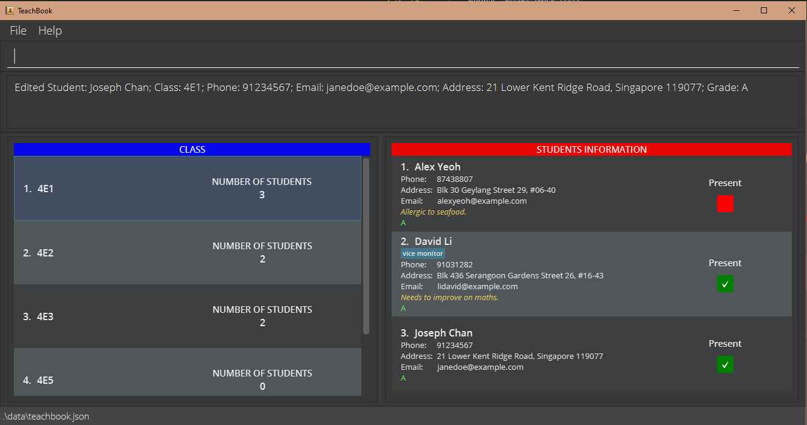
Fig 8: Student `Jane Doe` added in [add](#adding-a-student--add), has been renamed to `Joseph Chan` with no tags after `edit 3 n/Joseph Chan t/` is executed

 

#### Locating students by name : `find`

Scrolling through the whole list of students to find a specific student is often time-consuming.
You can use this command to search for students with the specified keywords in their names.

Format: `find KEYWORD…`

* The search is case-insensitive e.g. `john`, `JOHN` or `JoHn` will match `John`.
* The order of the keywords does not matter e.g. `Doe John` will match `John Doe`.
* Only the name is searched.
* Only full words will be matched e.g. `John` will not match `Johnny`.
* Students matching at least one keyword will be listed (i.e. OR search) e.g. `John Doe` will return `John Deer`, `Jane Doe`.

Examples:
* `find Jane Doe` returns only one `Jane Doe` from the currently selected class, even if there is another `Jane Doe` from a different class.
* `list all` followed by `find John Doe` returns two `John Doe`, assuming that there are two `John Doe` in the entire the TeachBook from different classes.

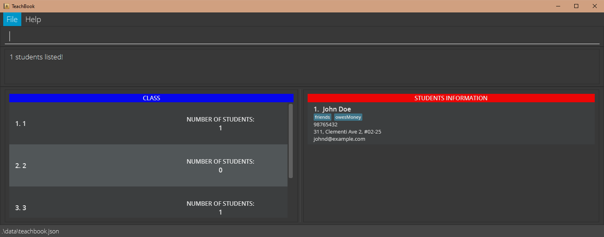
Fig 9: Student `Jane Doe` added in [add](#adding-a-student--add) is displayed in the student list after `find Jane Doe` is executed

 

#### Adding remark to a student : `remark`

If there are any comments you would like to leave for a student, you can do so with ease using this command.

Format: `remark INDEX r/[REMARK]`

* Adds the specified `REMARK` to the student at the specified `INDEX`.

Example:
* `remark 3 r/Contracted COVID-19` adds a remark to the 3rd student that he/she has contracted COVID-19.
* `remark 1 r/` clears previously added remark of the 1st student.

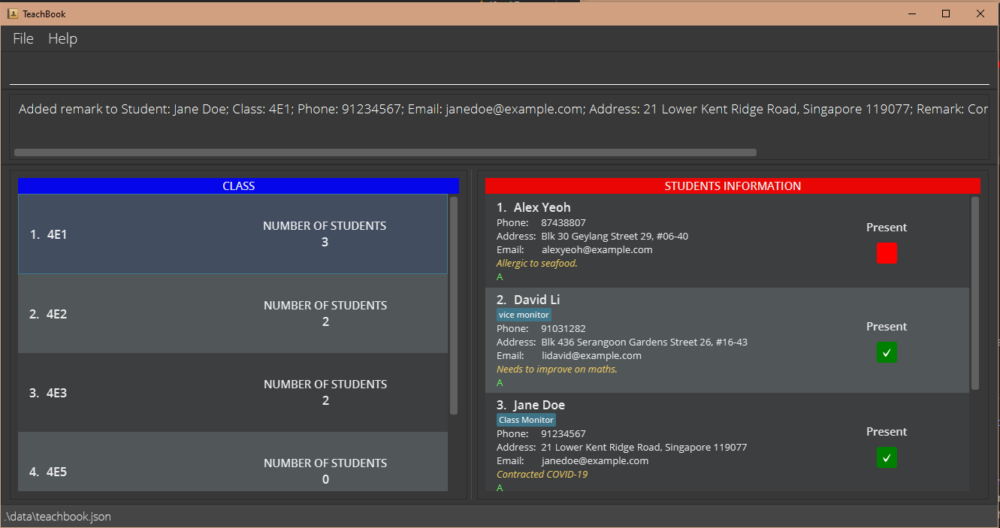
Fig 10: Student `Jane Doe` added in [add](#adding-a-student--add) is displayed with remark `Contracted COVID-19` after `remark 3 r/Contracted COVID-19` is executed

--------------------------------------------------------------------------------------------------------------------
[\[ Back to top \]](#table-of-contents)

### Grade related features
#### Setting a grading system : `setGrade`

TeachBook allows for the setting of a personalised grading system. You may implement your own grading system
which may differ from semester to semester and subject to subject in order to grade your students accordingly.

Format: `setGrade GRADE_1[>GRADE_2]…`

* Grades are set in descending order, from the highest to the lowest grade, separated by `>`.

:information_source: **Info:**
TeachBook currently only accepts one grading system at the same time. If there is already a system in use, 
you need to first reset the grading system using the [reset](#resetting-grading-system--resetGrade) command before setting a new one.

Example:
* `setGrade A>B>C>D` sets the grading system where `A` is the highest grade and `D` is the lowest grade.

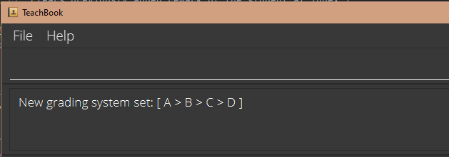 
Fig 11: New grading system is set after `setGrade A>B>C>D` is executed

#### Giving grade to a student : `grade`

This command allows you to assign grades to students.

Format: `grade INDEX…||all g/[GRADE]`

* A grading system should already exist in the TeachBook.
* `GRADE` must be from the previously set grading system.
* `grade INDEX… g/GRADE` gives the specified `GRADE` to the students at the specified `INDEX`s.
* `grade all g/GRADE` gives the specified `GRADE` to all the students currently displayed in the student list.

Example:
* `grade 1 g/B` gives the 1st student a `B` grade.
* `grade 2 4 5 g/A` gives the 2nd, 4th, and 5th students an `A` grade.
* `grade all g/A` gives an `A` grade to all the students currently displayed in the student list.
* `grade 1 g/` clears any grade of the 1st student.

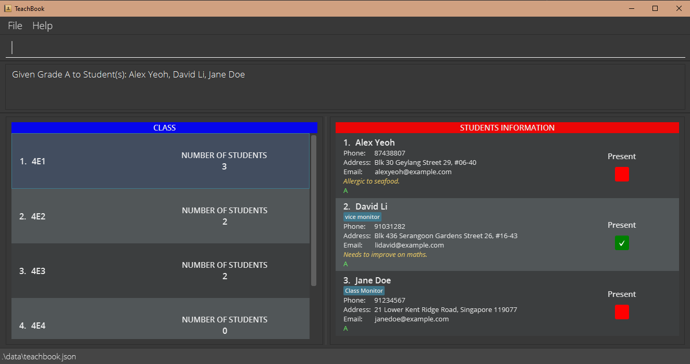
Fig 12: All students in Class `4E1` are given an `A` grade after `grade all g/A` is executed

#### Resetting grading system : `resetGrade`

Teachbook can only incorporate at most 1 grading system at any time. Therefore, you have to wipe out an existing
grading system before setting a new one. This command not only resets the grading system but also wipes out
all the grades previously given to the students.

Format: `resetGrade`

:exclamation: **Caution:**
All students' grades will be cleared!

--------------------------------------------------------------------------------------------------------------------
[\[ Back to top \]](#table-of-contents)

### Attendance related features
#### Marking the attendance of a student : `mark`

You can use this command to mark your students as present. The `present` checkbox will turn green with a tick indicating successful marking of attendance.

Format: `mark INDEX…||all`

* `mark INDEX…` marks the students at the specified `INDEX`s present.
* `mark all` marks all the students currently displayed in the student list present.

:information_source: **Info:**
This command will result in all the students in the list being shown. For example, if you execute `list absent` to filter out all absent students
and want to mark attendance one by one, it may not work as expected because after every `mark`, the list will no longer contain all absent students.
As a result, we recommend marking the attendance of multiple students at once.

:bulb: **Tip:**
After marking, you can generate the attendance list with the `print c/attendance` command. You might also want to check out the [print](#printing-to-excel--print) command for more columns available to be added.

Examples:
* `mark 3` marks the 3rd student present.
* `mark 2 3 4` marks the 2nd, 3rd, and 4th students as present.
* `mark all` marks all the students currently displayed in the student list present.

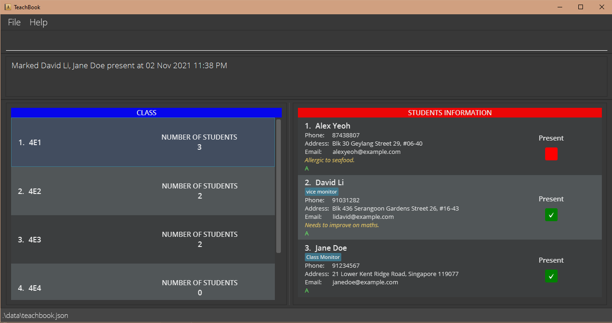
Fig 13: Student `Jane Doe` added in [add](#adding-a-student--add) is displayed with a green checkbox with a tick after `mark 3` is executed

 

#### Un-marking the attendance of a student : `unmark`

You can use this command to mark your students as absent. The `present` checkbox will turn red indicating successful un-marking of attendance.

Format: `unmark INDEX…||all`

* `unmark INDEX…` marks the students at the specified `INDEX`s as absent.
* `unmark all` marks all the students currently displayed in the student list as absent.

:bulb: **Tip:**
Before taking attendance for a new event, you can execute `list` followed by `unmark all` to clear the attendance of all students.

Examples:
* `unmark 3` marks the 3rd student as absent.
* `unmark 2 3 4` marks the 2nd, 3rd, and 4th students as absent.
* `unmark all` marks all the students currently displayed in the student list as absent.

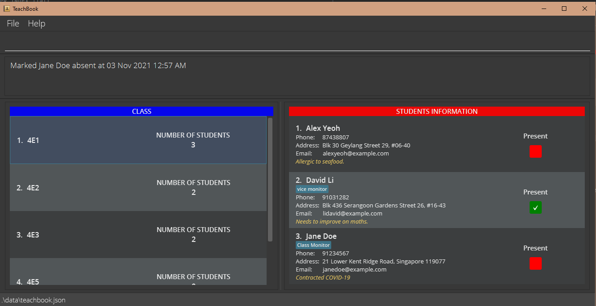
Fig 14: Student `Jane Doe`, who was previously [marked as present](#marking-the-attendance-of-a-student--mark), is now marked as absent and is displayed with a red checkbox after `unmark 3` is executed

--------------------------------------------------------------------------------------------------------------------
[\[ Back to top \]](#table-of-contents)

### Utility features
#### Printing to Excel : `print`

This command allows you to generate an Excel (.xls) file containing students in the **student list currently displayed** with customized columns.

Format: `print [c/class] [c/phone] [c/email] [c/address] [c/tags] [c/remark] [c/attendance] [c/grade] [c/COLUMN_TITLE]…`

* The first column always consists of the names of the students.
* Columns with special names as in the format will be populated with the respective information of the students.
* You can add one or more empty columns with the specified `COLUMN_TITLE`s.

:information_source: **Info:**
Putting an empty column title (i.e. `c/ `) will give you an empty column.

:bulb: **Tip:**
You can use this command to obtain a physical copy of the student list so that you can submit it to the management if required.

Examples:
* `print c/class c/email c/Signature` creates an Excel file with four columns: student name column, class column, email column, and an empty column with title `Signature`.

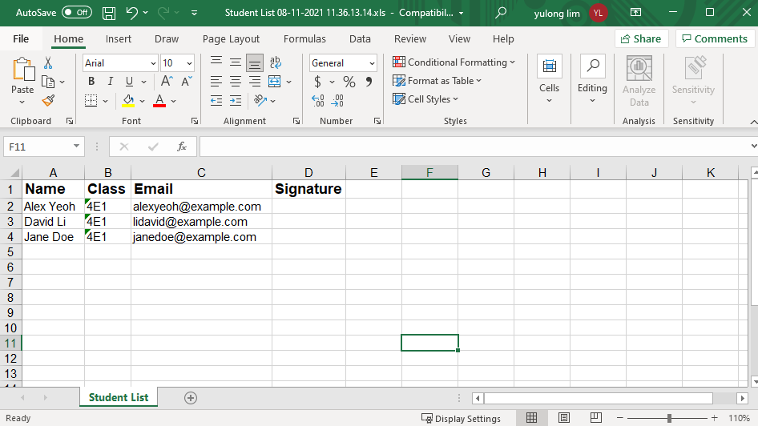
Fig 15: Excel sheet generated from TeachBook after `print c/class c/email c/Signature` is executed

 

#### Sorting students : `sort`

Unorganized student lists are a pain to see. This command allows sorting of the student list according to either their name or grade.

Format: `sort name||grade`

* `sort name` reorders students according to their name.
* `sort grade` reorders students according to their grade in descending order.
* Sorting by grade requires a grading system to be in place in the TeachBook.

:information_source: **Info:**
* When there is a currently selected class, `sort` will sort the entire student list of the class, not just the displayed student list.
* `sort` followed by `list all` will not sort individual class's student list.

:exclamation: **Caution:**
TeachBook currently does not store the order in which students are added to each class. 
This means you may not be able to restore the list to the order in which students are originally added.

Examples:
* `select 4E2` followed by `sort name` sorts the students in class `4E2` according to their name.
* `list all` followed by `sort grade` sorts all the students in the TeachBook according to their grade but will not reorder each class's student list.

 

#### Listing all students : `list`

You can use this command to list all the (absent) students from the currently selected class or the entire TeachBook.

Format: `list [all||absent]`

* `list` shows all the students in the current student list.
* `list all` lists all the students from all the classes.
* `list absent` lists all the students in the current student list whose attendance status is unmarked.
* When students from different classes are shown, each student's class is displayed in the top right corner of the student.

:information_source: **Info:**
`list all` should be interpreted as a way to unselect the currently selected class. Therefore, in order to view the original list after calling 
`list all` followed by other commands like `list absent`, `list all` won't take you back to the original list, you should not use `list all` 
as there is already no class selected. Instead, `list` command should be used to take you back to the original 
list by listing out all the students from all the classes as no class is selected.

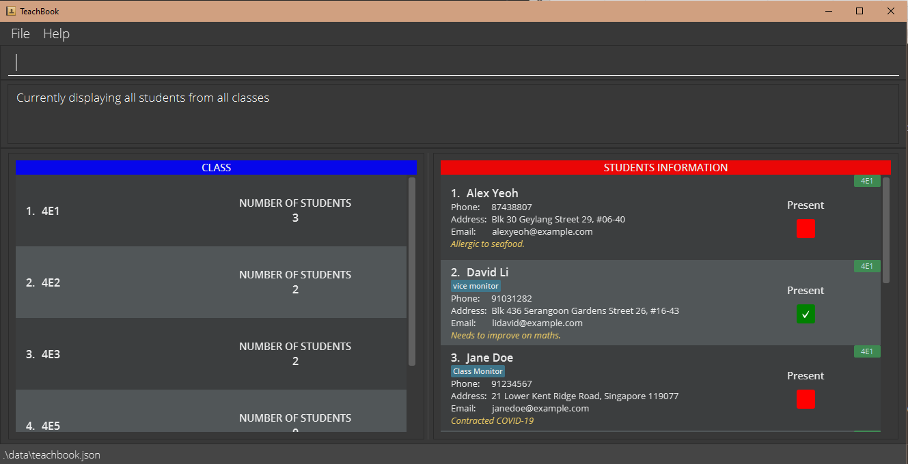
Fig 16: All students in the TeachBook are displayed after `list all` is executed

--------------------------------------------------------------------------------------------------------------------
[\[ Back to top \]](#table-of-contents)

### Others
#### Saving the data

TeachBook data are saved in the hard disk automatically after any command that changes the data. There is no need to save manually.

 

#### Editing the data file

TeachBook data are saved as a JSON file `[JAR file location]/data/teachbook.json`. Advanced users are welcome to update data directly by editing that data file.

:exclamation: **Caution:**
If your changes to the data file make its format invalid, TeachBook will discard all data and start with an empty data file at the next run.

--------------------------------------------------------------------------------------------------------------------
[\[ Back to top \]](#table-of-contents)

## FAQs

**Q**: How do I transfer my data to another computer?  
**A**: Install the app on the other computer and overwrite the empty data file it creates with the file that contains the data of your previous TeachBook.  

**Q**: Where does the Excel file save to after using the `print` command?  
**A**: It will be saved to your computer's download folder. A detailed file path is also given in the command result after the `print` command is executed.  

**Q**: There seems to be a lag after some commands. What can I do?  
**A**: Close any background programs or applications which are not in use on your computer.  

**Q**: When performing tasks on classes (e.g. deleting or selecting a class), I find it cumbersome to type the class name all the time. Can I select it by the index?  
**A**: Currently, it is still not possible. We have heard your feedback and are currently working on it to add this feature in. Do keep a lookout for our next update!  

--------------------------------------------------------------------------------------------------------------------
[\[ Back to top \]](#table-of-contents)

## Command Summary

Action                         | Format, Examples
-------------------------------|------------------
**Help**                       | `help`
**Clear all data**             | `clear`
**Undo previous command**      | `undo`
**Redo previous command**      | `redo`
**Exit**                       | `exit`
**Add class**                  | `addClass CLASS_NAME`   e.g., `addClass 4E4`
**Delete class**               | `deleteClass CLASS_NAME`   e.g., `deleteClass 4E4`
**Edit class**                 | `editClass CLASS_NAME`   e.g., `editClass 4E5`
**Select class**               | `select CLASS_NAME`   e.g., `select 4E2`
**Add student**                | `add n/NAME [p/PHONE_NUMBER] [e/EMAIL] [a/ADDRESS] [t/TAG]…`   e.g., `add n/Jane Doe p/91234567 e/janedoe@example.com a/21 Lower Kent Ridge Road, Singapore 119077 t/class monitor`
**Delete student**             | <code>delete INDEX…&#124;&#124;all</code>   e.g., `delete 1`
**Edit student**               | `edit INDEX [n/NAME] [p/PHONE_NUMBER] [e/EMAIL] [a/ADDRESS] [t/TAG]…`   e.g.,`edit 2 n/Joseph Chan t/`
**Find student**               | `find KEYWORD…`   e.g., `find James Jake`
**Add remark to student**      | `remark INDEX r/[REMARK]`   e.g., `remark 1 r/Contracted COVID-19`
**Set grading system**         | `setGrade GRADE_1[>GRADE_2]…`   e.g., `setGrade A>B>C>D`
**Give grade to student**      | <code>grade INDEX…&#124;&#124;all g/&#91;GRADE&#93;</code>   e.g., `grade 3 g/A`
**Reset grading system**       | `resetGrade`
**Mark student attendance**    | <code>mark INDEX…&#124;&#124;all</code>   e.g., `mark 1 2 3`
**Un-mark student attendance**  | <code>unmark INDEX…&#124;&#124;all</code>   e.g., `unmark 1 2 3`
**Print data as Excel file**   | `print [c/class] [c/phone] [c/email] [c/address] [c/tags] [c/remark] [c/attendance] [c/grade] [c/COLUMN_TITLE]…`   e.g., `print c/class c/email c/Signature`
**Sort students**              | <code>sort name&#124;&#124;grade</code>
**List students**              | <code>list &#91;all&#124;&#124;absent&#93;</code>

[\[ Back to top \]](#table-of-contents)
